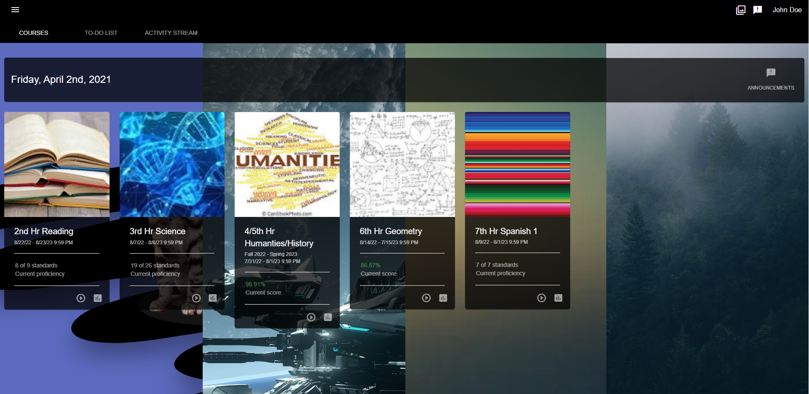

### Themius
Welcome to Themius a theme that redesigns Echo.

Themius aims to make Echo turn into a more friendly and more useable interface then what echo originally provides to the everyday users by optimizing several parts of the website and fixing serveral elements to make the ultimate web-page for your everyday use in school, thats if you even use echo.

You might find that Themius makes Echo feel more smooth, and simple compared to Echos original styling. This is not by accident, we made it this way because we want you to feel at home when working at school which is why we made Themius for Echo.

We make sure Themius is always updated with Echo and are always at it with new additions and fixes that make Echo feel like a professional platform to do work on, on a day to day basis.

 

### Make Echo Yours

Themius extension was made to redesign echo and give you amazing features you could ever dream of getting, 
this aims to do that and more so please come and install it you won't regret it! 

 
 

Download extension <a href="https://download-directory.github.io/?url=https://github.com/johnymcreed/Themius/tree/Default/extension">Here</a>
